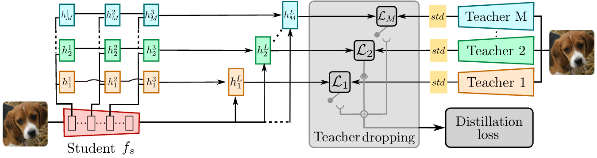
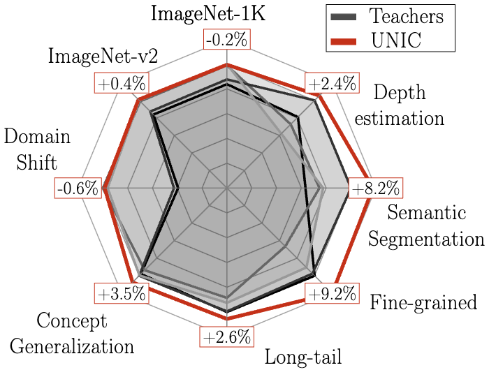
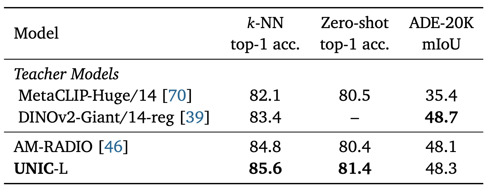

<div align="center">
<h1>UNIC: Universal Classification Models via Multi-teacher Distillation</h1>

[**Mert Bulent Sariyildiz**](https://mbsariyildiz.github.io/) · [**Philippe Weinzaepfel**](https://europe.naverlabs.com/people_user_naverlabs/philippe-weinzaepfel/) · [**Thomas Lucas**](https://europe.naverlabs.com/people_user_naverlabs/thomas-lucas/) · [**Diane Larlus**](https://europe.naverlabs.com/people_user_naverlabs/diane-larlus/) · [**Yannis Kalantidis**](https://europe.naverlabs.com/people_user_naverlabs/yannis-kalantidis/)

NAVER LABS Europe

**ECCV 2024**



---

</div>

- [Installation](#installation)
  - [Conda environment](#conda-environment)
  - [Teacher models](#teacher-models)
  - [Distillation dataset](#distillation-dataset)
- [Training UNIC models](#training-unic-models)
  - [Pretrained models](#pretrained-models)
    - [Distilled from teachers pretrained on ImageNet-1K](#distilled-from-teachers-pretrained-on-imagenet-1k)
    - [Distilled from teachers pretrained on arbitrary datasets](#distilled-from-teachers-pretrained-on-arbitrary-datasets)
- [Evaluating UNIC models](#evaluating-unic-models)
  - [Transfer learning tasks](#transfer-learning-tasks)
  - [Dense prediction tasks](#dense-prediction-tasks)
    - [Semantic segmentation on ADE20K](#semantic-segmentation-on-ade20k)
- [Citation](#citation)

# Installation

For training UNIC models on ImageNet-1K (by distilling from the four teachers we used in the paper), you need some Python packages, pretrained weights for the teacher models and the ImageNet-1K dataset.

## Conda environment

- Create a conda environment with all the necessary packages for training and evaluation:

```bash
env_name="unic"
conda create -n ${env_name}
conda activate ${env_name}
conda install pytorch=2.1.1 pytorch-cuda=12.1 torchvision \
    timm transformers einops torchmetrics optuna \
    tensorboard matplotlib pandas scikit-learn-intelex omegaconf \
    -c pytorch -c nvidia -c conda-forge
```

- Set the path of your conda in [scripts/setup_env.sh](./scripts/setup_env.sh), i.e. update the `conda_dir` variable.
Then your environment will be automatically used by both the training and evaluation scripts.

## Teacher models

- Download the teacher models we used in our work.
We provide bash scripts to automatize this process, under the [scripts/teachers](./scripts/teachers) folder.
To download all teachers at once, use [scripts/teachers/_prepare_all.sh](./scripts/teachers/_prepare_all.sh):
```bash
(cd scripts/teachers && ./_prepare_all.sh <path_to_download_directory>)
```

- Once teacher checkpoints are downloaded, update the `TEACHER_CFG` variable in [teachers/config.py](teachers/config.py) to point to the correct paths.

## Distillation dataset

- Download the ImageNet-1K dataset (ILSVRC-2012).
Check out the [official website](https://www.image-net.org/download.php) for details.

# Training UNIC models

- Use the [main_unic.py](./main_unic.py) script to train UNIC models.
By default, it distills the following four teachers into a ViT-Base/16 student:
    - DINO (`dino_vitbase_16`)
    - DeiT-III (`deit3_vitbase_16`)
    - iBOT (`ibot_vitbase_16`)
    - dBOT fine-tuned on ImageNet-1K classification (`dbotft_vitbase_16`)

So make sure to download the teacher models (see the [Teacher models](#teacher-models) section).

The architecture of the student encoder is compatible with [DINOv2](https://github.com/facebookresearch/dinov2/blob/main/dinov2/models/vision_transformer.py).

We trained our UNIC models on 4 GPUs, with minimum 32GB of memory per GPU.
The default batch size is 128 per GPU, adjust it according to your GPU memory (learning rate will be scaled accordingly).

- To train a UNIC model, use the following commands (available in [scripts/train_unic.sh](./scripts/train_unic.sh)):

```python
# - Initialize the conda environment
# - Set ${MASTER_ADDR}, ${MASTER_PORT}, ${N_GPUS} for distributed training
source ./scripts/setup_env.sh

dataset_dir="/path/to/imagenet-1k"
output_dir="/path/to/output_dir"
mkdir -p ${output_dir}

torchrun --rdzv-backend=c10d --rdzv-endpoint=localhost:0 --nnodes=1 --nproc_per_node=${N_GPUS} main_unic.py  \
    --data_dir=${dataset_dir} \
    --output_dir=${output_dir} \
    --seed=${RANDOM}
```

## Pretrained models

### Distilled from teachers pretrained on ImageNet-1K

We provide a pretrained UNIC model with the ViT-Base/16 architecture, distilled from the four teachers mentioned above.

<table>
  <thead>
    <tr>
      <th>Model</th>
      <th style="white-space: nowrap;">Teachers</th>
      <th>Distillation<br>Dataset</th>
      <th>Distillation<br>Resolution</th>
      <th>Student<br>Architecture</th>
      <th>ImageNet&#8209;1K<br>Classification</th>
      <th>ADE20K<br>Segmentation</th>
      <th>Model<br>Checkpoint</th>
      <th>Training<br>Arguments</th>
    </tr>
  </thead>
  <tbody>
    <tr>
      <td>UNIC</td>
      <td>DINO&#8209;B/16<br>iBOT&#8209;B/16<br>DeiT&#8209;III&#8209;B/16<br>dBOT&#8209;ft&#8209;B/16</td>
      <td style="text-align:center;">ImageNet&#8209;1K</td>
      <td style="text-align:center;">224</td>
      <td style="text-align:center;">ViT&#8209;Base/16</td>
      <td style="text-align:center;">83.8</td>
      <td style="text-align:center;">39.6<br>(<a href="https://download.europe.naverlabs.com/ComputerVision/unic/unic_head_ade20k.pth">Linear&nbsp;head&nbsp;link</a>)</td>
      <td style="text-align:center;"><a href="https://download.europe.naverlabs.com/ComputerVision/unic/unic.pth">Link<br>(870MB)</a></td>
      <td style="text-align:center;"><a href="https://download.europe.naverlabs.com/ComputerVision/unic/unic_args.json">Link</a></td>
    </tr>
  </tbody>
</table>


The relative performance of UNIC over the four teachers is shown below.

<div align="center">

</div>

### Distilled from teachers pretrained on arbitrary datasets

We also provide a pretrained UNIC-L model with the ViT-Large/14 architecture distilled from DINOv2-G/14 and MetaCLIP-H/14 teachers.

<table>
  <thead>
    <tr>
      <th>Model</th>
      <th style="white-space: nowrap;">Teachers</th>
      <th>Distillation<br>Dataset</th>
      <th>Distillation<br>Resolution</th>
      <th>Student<br>Architecture</th>
      <th>ImageNet&#8209;1K<br>k-NN (k=20)</th>
      <th>ImageNet&#8209;1K<br>Zero&#8209;shot</th>
      <th>ADE20K<br>Segmentation</th>
      <th>Model<br>Checkpoint</th>
      <th>Training<br>Arguments</th>
    </tr>
  </thead>
  <tbody>
    <tr>
      <td>UNIC&#8209;L</td>
      <td>DINOv2&#8209;G/14<br>MetaCLIP&#8209;H/14</td>
      <td style="text-align:center;">ImageNet&#8209;1K</td>
      <td style="text-align:center;">224/336</td>
      <td style="text-align:center;">ViT&#8209;Large/14</td>
      <td style="text-align:center;">85.6</td>
      <td style="text-align:center;">81.4</td>
      <td style="text-align:center;">48.3<br>(<a href="https://download.europe.naverlabs.com/ComputerVision/unic/unic_l_head_ade20k.pth">Linear&nbsp;head&nbsp;link</a>)</td>
      <td style="text-align:center;"><a href="https://download.europe.naverlabs.com/ComputerVision/unic/unic_l.pth">Link<br>(2.2GB)</a></td>
      <td style="text-align:center;"><a href="https://download.europe.naverlabs.com/ComputerVision/unic/unic_l_args.json">Link</a></td>
    </tr>
  </tbody>
</table>


Comparison of UNIC-L to the teachers and recent AM-RADIO model is shown below.

<div align="center">

</div>

# Evaluating UNIC models

## Transfer learning tasks

The evaluation protocol for transfer learning tasks involves two steps:
- Extracting features from the encoder of a pretrained UNIC model
- Training logistic regression classifiers on top of the extracted features

We use the implementation from [t-ReX](https://arxiv.org/abs/2206.15369), which is available at [https://github.com/naver/trex](https://github.com/naver/trex).
For convenience, the evaluation code is copied in the [eval_transfer](./eval_transfer) folder of this repository.

First, download the transfer datasets following [the instructions in t-ReX repository](https://github.com/naver/trex/tree/master/transfer#data).
Once download finishes, update the hardcoded dataset paths in the [eval_transfer/data/init.py](./eval_transfer/data/__init__.py) file.
Then, use the following command to evaluate a pretrained UNIC model on, e.g. the ImageNet-1K dataset (with labels):
```bash
source scripts/setup_env.sh

##########
# extract features
dataset="in1k"
image_size=224
pretrained="/path/to/unic/checkpoint.pth"

features_dir=$(dirname "${pretrained}")
features_dir=${features_dir}/transfer/features_${dataset}_${image_size}

if [ ! -f "${features_dir}/features_trainval.pth" ] || [ ! -f "${features_dir}/features_test.pth" ]; then
    echo "Extracting features..."
    python eval_transfer/main_ft_extract.py \
        --output_dir="${features_dir}" \
        --pretrained="${pretrained}" \
        --dataset="${dataset}" \
        --image_size="${image_size}"
fi

##########
# train logreg classifier using extracted features
features_norm="none"
clf_type="logreg_sklearn"
if [[ "${dataset}" == "in1k" ]] || [[ "${dataset}" == cog_* ]] || [[ "${dataset}" == inat* ]]; then
    # for large datasets,
    # we use SGD implemented in PyTorch and l2 normalize features
    features_norm="l2"
    clf_type="logreg_torch"
fi

echo ""
echo "Training classifier ..."
python -m sklearnex eval_transfer/main_clf.py --features_dir="${features_dir}" --features_norm=${features_norm} --clf_type=${clf_type}
```

See the `--dataset` argument in [main_ft_extact.py](./eval_transfer/main_ft_extract.py) for the list of available datasets.

## Dense prediction tasks

### Semantic segmentation on ADE20K

First, download the ADE20K dataset from [the official website](http://sceneparsing.csail.mit.edu/index_challenge.html).

We follow the evaluation protocol from DINOv2, which requires some extra packages like mmcv with specific versions.
You can install them using the commands below:
```bash
pip install openmim
mim install "mmcv-full==1.7.2"
mim install "mmengine==0.10.1"
pip install "mmsegmentation==0.30.0"
pip install ftfy
```

If you encounter any mismatch between package versions, we recommend creating a new conda environment as mentioned in [the DINOv2 repository](https://github.com/facebookresearch/dinov2?tab=readme-ov-file#installation).

Then, use the following command to evaluate a pretrained UNIC model on the ADE20K semantic segmentation task (default hyper-parameters are set for 1 GPU):

```bash
source ./scripts/setup_env.sh

data_dir=/path/to/ADEChallengeData2016
pretrained="/path/to/unic/checkpoint.pth"

python eval_dense/eval_semseg.py --data_dir=${data_dir} --pretrained=${pretrained}
```

# Citation

If you find this repository useful, please consider citing us:

```LaTeX
@inproceedings{sariyildiz2024unic,
    title={UNIC: Universal Classification Models via Multi-teacher Distillation},
    author={Sariyildiz, Mert Bulent and Weinzaepfel, Philippe and Lucas, Thomas and Larlus, Diane and Kalantidis, Yannis},
    booktitle={European Conference on Computer Vision (ECCV)},
    year={2024},
}
```
